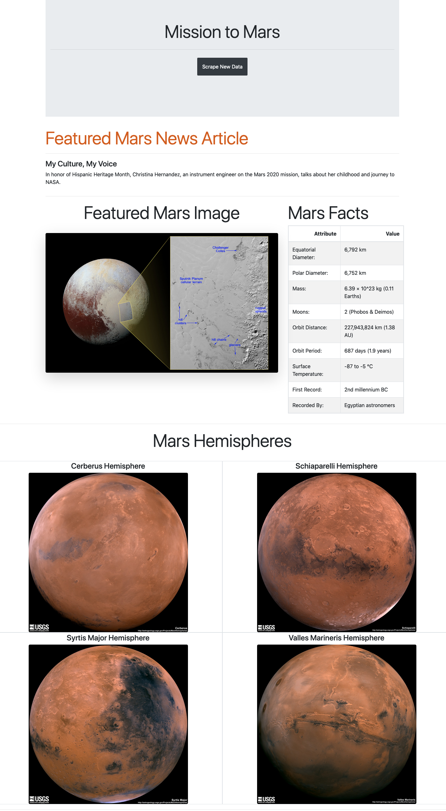

# Mars Rover Web Scraping App
**Completed By:** Lauren Stein\
**Objective:** Build a web application that scrapes various websites for data related to the Mission to Mars and displays the information in a single HTML page.

# Web Scraping

* Utilized Jupyter Notebook, BeautifulSoup, Pandas, and Requests/Splinter to scrape data from various NASA webpages

### NASA Mars News
* Scraped the [NASA Mars News Site](https://mars.nasa.gov/news/) and collected the latest News Title and Paragraph Text. 

### JPL Mars Space Images - Featured Image
* Visited the url for JPL Featured Space Image [here](https://www.jpl.nasa.gov/spaceimages/?search=&category=Mars).

* Used splinter to navigate the site and find the image url for the current Featured Mars Image and assign the url string to a variable called `featured_image_url`.

### Mars Facts
* Visited the Mars Facts webpage [here](https://space-facts.com/mars/) and use Pandas to scrape the table containing facts about the planet including Diameter, Mass, etc.

* Used Pandas to convert the data to a HTML table string.

### Mars Hemispheres

* Visited the USGS Astrogeology site [here](https://astrogeology.usgs.gov/search/results?q=hemisphere+enhanced&k1=target&v1=Mars) to obtain high resolution images for each of Mar's hemispheres.

* Select hemisphere links to find image url to the full resolution image.

* Saved both the image url string for the full resolution hemisphere image, and the Hemisphere title containing the hemisphere name. Used a Python dictionary to store the data using the keys `img_url` and `title`.

* Append the dictionary with the image url string and the hemisphere title to a list. This list will contain one dictionary for each hemisphere.

# MongoDB and Flask Application

Use MongoDB with Flask templating to create a new HTML page that displays all of the information that was scraped from the URLs above.

* Converted Jupyter notebook into a Python script called `scrape_mars.py` with a function called `mars_info` to execute all of the scraping code and return a Python dictionary. 

* Route called `/scrape` imports `scrape_mars.py` script and call `mars_info` function.

* Root route `/` to query the Mongo database and pass the mars data into an HTML template to display the data.

* Template HTML file called `index.html` that will take the mars data dictionary and display all of the data in the appropriate HTML elements. 

# Visit Mission to Mars App

